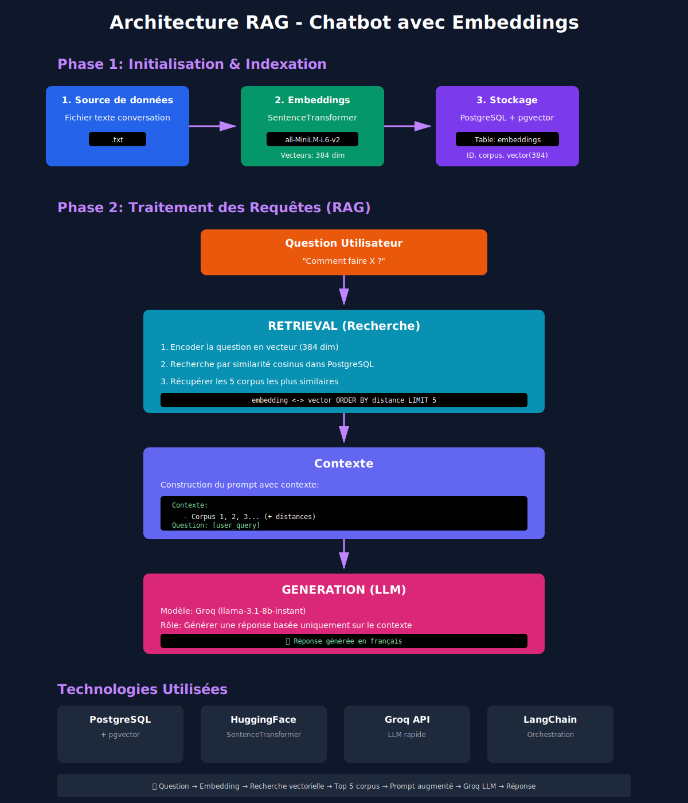

# 🤖 Chatbot RAG avec PostgreSQL, pgvector et Groq

Un chatbot intelligent basé sur l'architecture RAG (Retrieval-Augmented Generation) qui permet de poser des questions sur des transcriptions de conversations téléphoniques.

## 📋 Table des matières
- [Fonctionnalités](#-fonctionnalités)
- [Architecture](#-architecture)
- [Prérequis](#-prérequis)
- [Installation](#-installation)
- [Utilisation](#-utilisation)

## ✨ Fonctionnalités

- **Recherche sémantique** : Trouve les passages les plus pertinents dans les conversations
- **Génération de réponses** : Utilise Groq LLM pour fournir des réponses précises
- **Base de données vectorielle** : Stocke et interroge les embeddings avec PostgreSQL + pgvector
- **Interface en ligne de commande** : Interface interactive simple à utiliser
- **Support multilingue** : Traitement des conversations en français

## 🏗️ Architecture



## 📋 Prérequis

### Logiciels nécessaires
- Python 3.8+
- PostgreSQL 
- pgvector extension
- Compte Groq API (gratuit)

### Comptes API nécessaires
- [Groq Cloud](https://console.groq.com/) pour obtenir une clé API

## 🚀 Installation

### 1. Cloner le dépôt
```bash
git clone https://github.com/Hiba-Hriz/Chatbot-RAG.git
cd Chatbot-RAG
```

### 2. Créer un environnement virtuel
```bash
python -m venv venv
source venv/bin/activate  # Sur Linux/Mac
# ou
venv\Scripts\activate     # Sur Windows
```

### 3. Configurer la base de données

Modifier le fichier .env avec vos informations

# Clé API Groq (obtenue sur https://console.groq.com)
GROQ_API_KEY=votre_clé_groq_ici

# Chemin vers votre fichier de conversation
CONVERSATION_FILE_PATH=chemin/vers/votre/fichier.txt

# Configuration PostgreSQL
```bash
DB_HOST=localhost
DB_NAME=rag_chatbot
DB_USER=postgres
DB_PASSWORD=votre_mot_de_passe_ici
DB_PORT=5432
```
### 🎮 Utilisation

Lancer le chatbot
